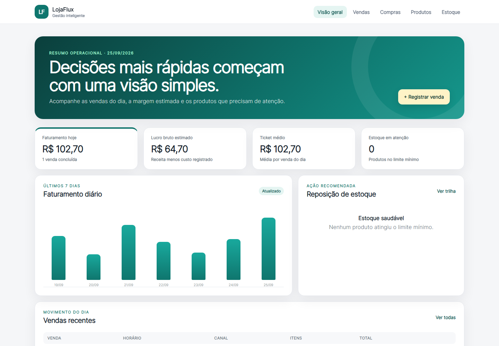

# LojaFlux

Sistema web de gestão para pequenos comércios, inspirado em desafios observados em uma loja real. O projeto conecta compras, vendas, estoque e indicadores diários em uma experiência simples e rastreável.

> Projeto de portfólio. Todos os nomes, valores e registros da demonstração são fictícios.



## Problema de negócio

Quando compras, vendas e estoque são controlados separadamente, o responsável pela loja perde tempo conciliando informações e pode tomar decisões com dados desatualizados. O LojaFlux centraliza esses eventos e mantém o estoque sincronizado a cada operação.

## Funcionalidades do MVP

- cadastro de produtos com preço, custo e estoque mínimo;
- registro de compras com atualização de custo e entrada de estoque;
- venda com vários itens e baixa de estoque em uma única transação;
- histórico de vendas do dia;
- trilha imutável de movimentações de estoque;
- dashboard com faturamento, lucro estimado, ticket médio e alertas;
- API JSON de saúde e resumo do dashboard;
- dados demonstrativos opcionais;
- testes automatizados das regras principais.

## Decisões técnicas

- valores monetários são armazenados em centavos, evitando erros de ponto flutuante;
- vendas guardam cópias do preço e custo do momento da operação;
- compras e vendas atualizam estoque na mesma transação;
- movimentações de estoque não são apagadas, preservando rastreabilidade;
- o MVP funciona localmente com SQLite e não depende de serviços externos.

## Tecnologias

Python 3.12, Flask, SQLAlchemy, SQLite, Jinja2, HTML, CSS, JavaScript e Pytest.

## O que este projeto demonstra

- tradução de um problema cotidiano em requisitos de produto;
- separação entre interface, regras de negócio e persistência;
- modelagem de compras, vendas, itens e movimentações;
- consistência transacional e preservação do histórico;
- testes orientados ao comportamento esperado;
- comunicação visual de indicadores para pessoas não técnicas.

## Estrutura principal

```text
app/
├── models.py       # entidades e relacionamentos
├── services.py     # regras transacionais de compra e venda
├── routes.py       # páginas e endpoints JSON
├── templates/      # interface renderizada no servidor
└── static/         # estilos e interação no navegador
tests/              # testes das regras e rotas
```

## Como executar

```powershell
python -m venv .venv
.\.venv\Scripts\Activate.ps1
python -m pip install -r requirements.txt
python -m flask --app run.py seed-demo
python run.py
```

Abra `http://127.0.0.1:5000`.

Para executar os testes:

```powershell
pytest -q
```

## Endpoints de demonstração

- `GET /api/health` — estado do serviço;
- `GET /api/dashboard` — indicadores do dia e série dos últimos sete dias.

## Próximos passos

- cancelamentos por evento de estorno, preservando histórico;
- fechamento diário de caixa e divisão por meios de pagamento;
- previsão simples de demanda com dados históricos;
- exportação de relatórios;
- autenticação e perfis de acesso para uma futura versão em rede.

